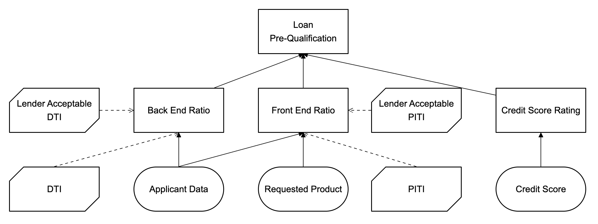

<!--
   Licensed to the Apache Software Foundation (ASF) under one
   or more contributor license agreements.  See the NOTICE file
   distributed with this work for additional information
   regarding copyright ownership.  The ASF licenses this file
   to you under the Apache License, Version 2.0 (the
   "License"); you may not use this file except in compliance
   with the License.  You may obtain a copy of the License at
     http://www.apache.org/licenses/LICENSE-2.0
   Unless required by applicable law or agreed to in writing,
   software distributed under the License is distributed on an
   "AS IS" BASIS, WITHOUT WARRANTIES OR CONDITIONS OF ANY
   KIND, either express or implied.  See the License for the
   specific language governing permissions and limitations
   under the License.
-->

## @kie-tools/dmn-editor

The Apache KIE DMN Editor.

This package exposes the `<DmnEditor>` React component. Features include:

- Support for the DMN 1.6 specification (minimum version is DMN 1.2)
  - Files will automatically be converted to DMN 1.6 after a first modification happens.
- Best-effort backwards compatibility with the [Apache KIE DMN Editor (classic)](https://www.npmjs.com/package/@kie-tools/kie-editors-standalone) — no longer available (last available in Apache KIE 10.1).
- Extension points compatible with the Drools DMN Engine and Kogito.
  - Attachments
  - Persistent widths on Boxed Expressions
  - Constraint types (`range`, `expression`, `enumerated`)
- Dedicated Data Types editor
- Exporting the DMN diagram to SVG
- Built in the "[Controlled component](https://legacy.reactjs.org/docs/forms.html#controlled-components)" pattern
- Type-safe model representation (incl. extension points) powered by [@kie-tools/dmn-marshaller](../dmn-marshaller/README.md)
- Autolayout

The Apache KIE DMN Editor is built with [Reactflow](https://reactflow.dev/) and shares a lot of good qualities from the Apache KIE DMN Editor, like:

- Grid snapping
- Commands-based programmatic API (E.g., Binding to keyboard shortcuts)
- Infinite canvas
- Multi-node and edge selection

---

### Usage

- Add the `<DmnEditor>` component to your React application; _or_
- Use the Apache KIE DMN Editor as a standalone JavaScript/TypeScript library. See [@kie-tools/dmn-editor-standalone](../dmn-editor-standalone/README.md).

---

### Screenshots

> 
> A screenshot of a Loan Pre-qualification decision created with Apache KIE DMN Editor

---

## For development information see:

- 👉 [DEV.md](./docs/DEV.md)
- 👉 [TESTS.md](./docs/TESTS.md)
- 👉 [ARCHITECTURE.md](./docs/ARCHITECTURE.md)

---

Apache KIE (incubating) is an effort undergoing incubation at The Apache Software
Foundation (ASF), sponsored by the name of Apache Incubator. Incubation is
required of all newly accepted projects until a further review indicates that
the infrastructure, communications, and decision making process have stabilized
in a manner consistent with other successful ASF projects. While incubation
status is not necessarily a reflection of the completeness or stability of the
code, it does indicate that the project has yet to be fully endorsed by the ASF.

Some of the incubating project’s releases may not be fully compliant with ASF
policy. For example, releases may have incomplete or un-reviewed licensing
conditions. What follows is a list of known issues the project is currently
aware of (note that this list, by definition, is likely to be incomplete):

- Hibernate, an LGPL project, is being used. Hibernate is in the process of
  relicensing to ASL v2
- Some files, particularly test files, and those not supporting comments, may
  be missing the ASF Licensing Header

If you are planning to incorporate this work into your product/project, please
be aware that you will need to conduct a thorough licensing review to determine
the overall implications of including this work. For the current status of this
project through the Apache Incubator visit:
https://incubator.apache.org/projects/kie.html
